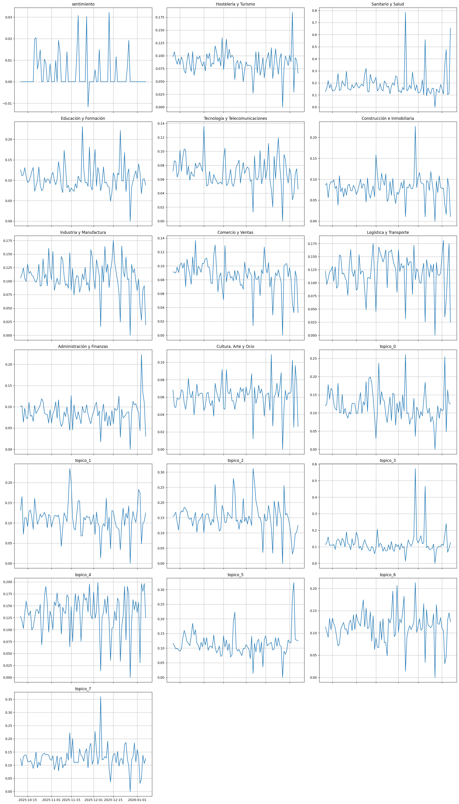
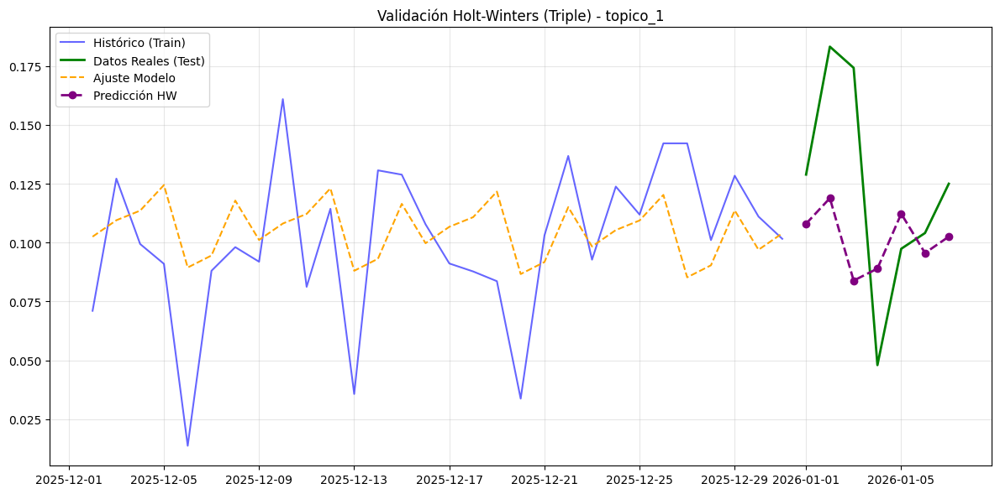
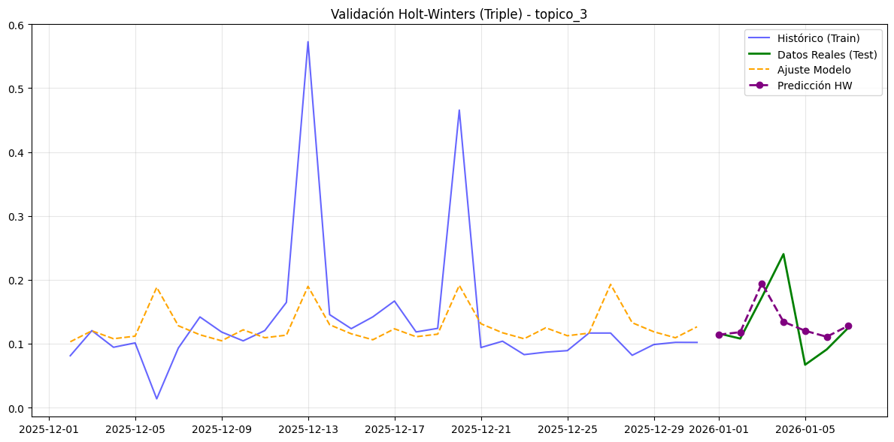
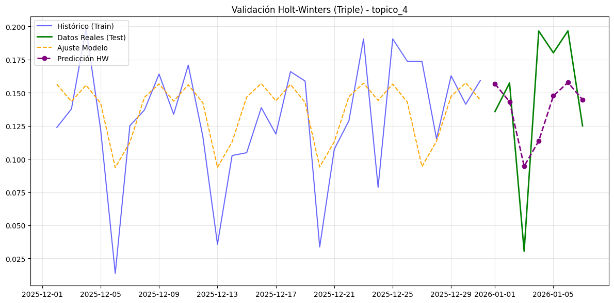
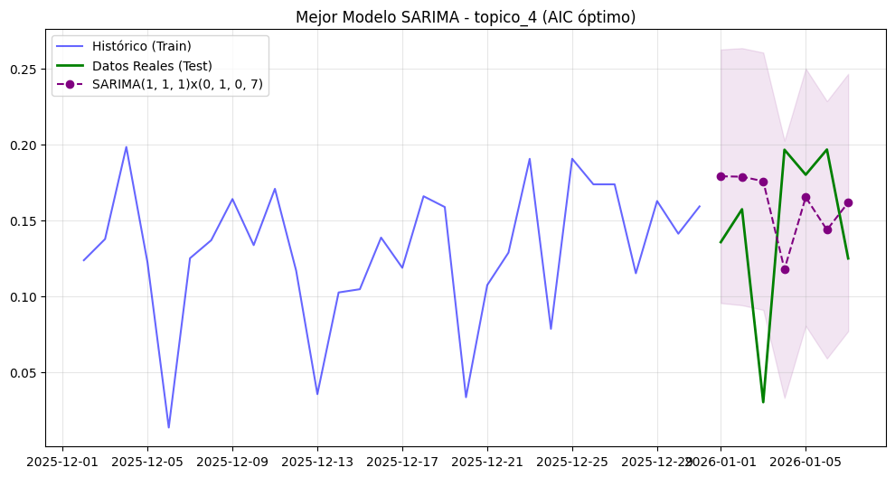
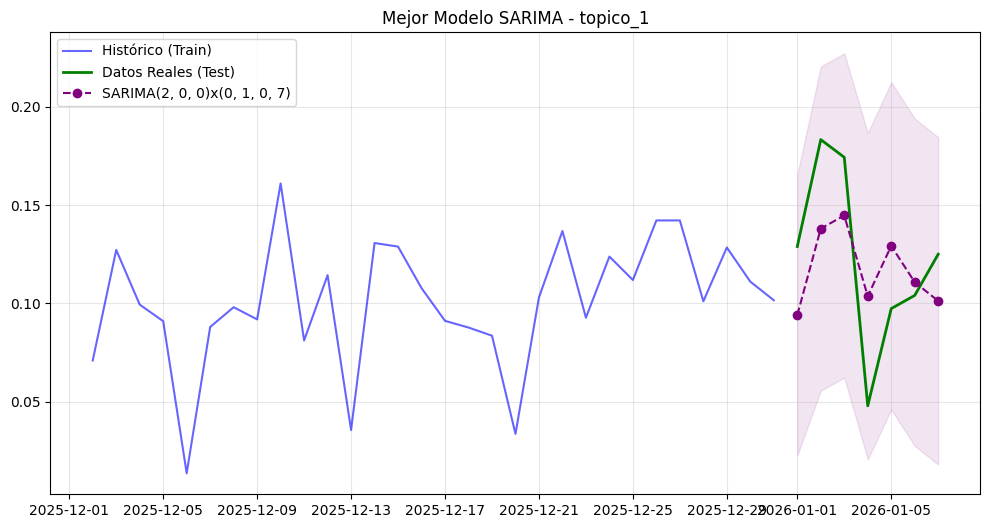
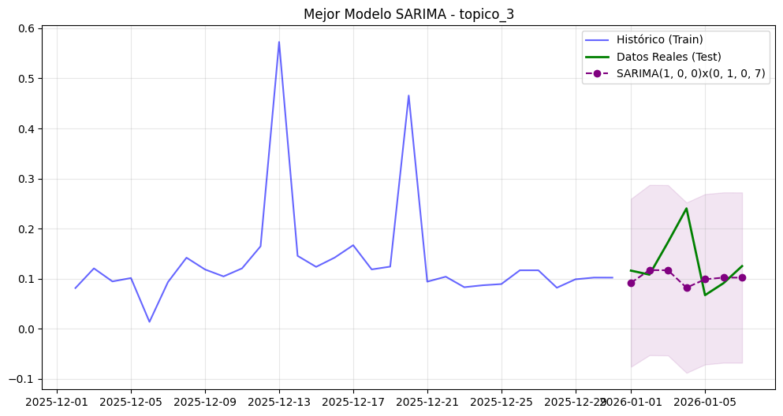

## Hipótesis: 
1. El tópico 2 (ocupacional, residencial, supervisar, terapeuta...) aparecen con mayor frecuencia en el sector Sanitario y Salud.
2. Las ofertas del sector logístico presentan mayor actividad en el inicio de diciembre, en preparación para la campaña navideña.
3. El tópico 6 (ingeniero, civil, fiscal, proveedor, sede...) predomina en el sector de Administración y Finanzas.
4. Los sectores de Hostelería y Turismo muestra una mayor dispersión temática con respecto a los tópicos
5. Los fines de semana aparentan un claro descenso de las ofertas laborales.

## Técnicas aplicadas:

### Análisis preliminar y preparación de datos:
Hemos empezado previsualizando el comportamiento temporal de todos los indicadores: tópicos, sector y sentimiento.
Para ello decidimos agrupar por días, calcular la media diaria de los valores.

Vimos una gran similitud entre varias gráficas, sobretodo en los sectores, donde se puede ver que, por ejemplo, `Tecnología y Telecomunicaciones`, se parece mucho a `Comercio y Ventas` o `Industria y Manufactura` con `Logística y Transporte`, compartiendo picos, pudiendo indicar correlación.

Viendo al alta correlación entre los temas, decidimos centrarnos en los tópicos.

### Busqueda estacionariedad:
Se ha utilizado el test de estacinariedad (ADF), y en el tópico 4, el único no estacionario, se ha aplicado el ADF a su diferenciación.

### Busqueda estacionalidad:
Para obtener información sobre la estacionalidad, hemos calculado y gráficado el ACF y PACF para todos los tópicos.

### Análisis de Tendencia:

Para analizar la tendencia, hemos aplicado la decomposición estacional para los tópicos que pueden contener estacionalidad y la media movil para buscar la tendencia en el resto de tópicos.

### Suavizado exponencial
Para los tópicos 1, 3 y 4, los que tienen estacionalidad, al tener un ciclo de 7 días, hemos usado Holt-Winters (Triple Suavizado).
Para el resto de tópciso,como no tienen ni estacionalidad, ni estacionariedad ni tendencia, se ha aplicado el Suavizado Exponencial Simple, que simplemente estima filtrando el ruido.

### SARIMA
Los tópicos estacionales son siempre cada 7 dias, por tanto el valor estacional es siempre 7. Para todos los topicos salvo el 4 (donde d=1), el valor de d=0 ya que no requiere diferenciación para lograr ser estacionaria.

Para determinar los parámetros óptimos (p, q, P, Q) de cada modelo, hemos implementado una Grid Search que evalúa múltiples combinaciones respetando las restricciones de integración y estacionalidad de cada tópico.

La selección del mejor modelo se ha basado en minimizar el Criterio de Información de Akaike (AIC). Hemos preferido el AIC sobre el BIC porque nuestro objetivo es maximizar la capacidad predictiva a corto plazo. El AIC estima mejor el error de predicción futuro y evita el riesgo de seleccionar modelos demasiado simples que el BIC podría favorecer al penalizar, además nuestra muestra no es demasido densa y el BIC tiende a tener mejor desempeño cuando la muestra es grande, para evitar el sobreajuste.

### SARIMAX
Por último hemos aplicado SARIMAX, para buscar exogenias con los sectores de las ofertas en los tópicos 1,3 y 4.

## Resultados

### Busqueda estacionariedad:
Utilizando el test de estacinariedad (ADF), hemos visto que todos los tópicos menos el 4 son estacionarios, por lo que solo se ha integrado el tópico 4, conseguiendo que también sea estacionario.
| Tópico   | ADF Statistic        | p-value | Estacionaria |
|----------|----------------------|---------|--------------|
| topico_0 | -9.067006715956293   | 0.000   | True         |
| topico_1 | -3.4636076305279686  | 0.009   | True         |
| topico_2 | -6.525953686345409   | 0.000   | True         |
| topico_3 | -8.377697691552502   | 0.000   | True         |
| topico_4 | -1.9993058288520613  | 0.287   | False        |
| topico_5 | -6.454042146456745   | 0.000   | True         |
| topico_6 | -9.037405829997091   | 0.000   | True         |
| topico_7 | -8.698242667419844   | 0.000   | True         |

El número mínimo de diferenciaciones necesarias para hacer la serie estacionaria corresponde únicamente al **tópico 4**, donde se requiere $\mathbf{d=1}$. Este es el valor que debe utilizar en su modelo ARIMA para dicho caso, es decir, $\text{ARIMA}(p,\mathbf{1},q)$. Para el resto de los tópicos, al ser ya estacionarios, el valor adecuado es $\text{ARIMA}(p,0,q)$.

### Busqueda estacionalidad:

El único tópico que el test de Dickey-Fuller identificó como no estacionario fue el **tópico 4** con un p-value muy alto de 0.872. Esto indica que la serie debe ser tratada con diferenciación.

Al observar sus correlogramas (ACF/PACF), destaca un patrón de dependencia estacional significativa cada 7 y 14 días. Para capturar esta estructura, un suavizado exponencial simple no es suficiente.

Los **tópicos 1 y 3** presentan un p-value de 0.000 en el test ADF, lo que confirma que las series son estacionarias.

Sin embargo, al analizar sus correlogramas, observamos una estacionalidad clara cada 7 días en ambos casos.  Esto nos indica que su comportamiento parece estar regido por un ciclo semanal.

El resto de Tópicos (0, 2, 5, 6, 7) no parecen estacionarios, aunque algunos muestran una ligera influencia del día inmediatamente anterior (como el 2 y el 5), esto refleja una memoria muy corta y no una estructura cíclica que justifique un modelo estacional complejo.

### Análisis de Tendencia:

En lo referente a los **Tópicos 1 y 3**, la descomposición captura picos significativos de actividad (en noviembre para el Tópico 1 y diciembre para el Tópico 3), que se reflejan como subidas bruscas y aisladas en la tendencia. En el caso del Tópico 3, esto sugiere la presencia de una anomalía específica o un shock exógeno, respaldando la hipótesis planteada en el estudio: *"Las ofertas del sector logístico presentan mayor actividad en el inicio de diciembre, en preparación para la campaña navideña"*. Con respecto al Tópico 1 no podemos añadir información adicional sobre sus causas por que no hay nigún sector determinante ni plateamos ninguna hipótesis respeto a el. Descartando estos eventos puntuales, ninguna de las dos series muestra una tendencia significativa a largo plazo, retornando a sus niveles base tras los periodos de mayor actividad.

Respecto al **Tópico 4**, se observa una tendencia "nerviosa" que confirma la no estacionariedad estadística de la serie. Sin embargo, la tendencia oscila constantemente sin una dirección determinada y, por tanto, consideramos que no se detecta una tendencia sostenida de crecimiento o decrecimiento.

Finalmente, de carácter general, el **resto de tópicos (0, 2, 5, 6 y 7)** no presentan ninguna tendencia direccional a destacar. A diferencia de los casos anteriores, estos tópicos exhiben un comportamiento estacionario en media, oscilando alrededor de valores constantes con desviaciones similares entre sí. Aunque se observan picos puntuales de volatilidad, estos no se traducen en cambios estructurales y son considerados como ruido.

### Suavizado exponencial
Para los tópicos 1, 3 y 4, los que tienen estacionalidad, al tener un ciclo de 7 días, hemos usado Holt-Winters (Triple Suavizado).
Para el resto de tópciso,como no tienen ni estacionalidad, ni estacionariedad ni tendencia, se ha aplicado el Suavizado Exponencial Simple, que simplemente estima filtrando el ruido.

#### Resultados Holt-Winters:

Para los **Tópicos 1, 3 y 4**, al aplicar el modelo de triple suavizado (Holt-Winters), el modelo logra capturar correctamente la fase del ciclo (acierta en las subidas y bajadas semanales), vuelve a corroborar la estacionalidad de 7 días. Sin embargo, la predicción no es perfecta en cuanto a magnitud por que el modelo tiende a ser conservador y el componente aleatorio tiene un peso muy significativo que cuesta predecir con exactitud. 

Para el **resto de tópicos (0, 2, 5, 6 y 7)**, la aplicación del Suavizado Exponencial Simple arroja una predicción plana. Este resultado tiene sentido ya que al no considerar ni tendencia ni estacionalidad, el modelo determina que la mejor predicción posible es el nivel medio actual. La gran diferencia entre la predicción y los datos reales ilustra un nivel de ruido muy intenso, lo que nos puede dar a pensar que existe alguna influencia exogenea en las series. 

### SARIMA
#### Tópico 4
El modelo SARIMA seleccionado `(1, 1, 1)x(0, 1, 0, 7)` arroja resultados muy similares a los obtenidos previamente con el suavizado exponencial. Aunque el modelo identifica la periodicidad y la dirección de los cambios, **falla sistemáticamente en capturar la magnitud de la volatilidad**, como sucedía con el Holt-Winters. La predicción incapaz de alcanzar los picos extremos de la serie real. Esto evidencia que la complejidad adicional del modelo SARIMA no aporta una ventaja frente al suavizado exponencial en nuestro caso, ya que el componente de ruido  es tan dominante que limita la precisión de cualquier modelo.

#### Tópicos 1 y 3
De manera análoga, los modelos SARIMA para los Tópicos 1 y 3 muestran las mismas limitaciones que sus contrapartes de suavizado, solo se detecta una pequeña mejora en el tópico 1. Capturan el ciclo base, pero se ven desbordados por la variabilidad de la serie.

A pesar de los picos exógenos observados (noviembre/diciembre), hemos decidido no utilizar modelos SARIMAX, ya que estos eventos puntuales (campaña navideña y Black Friday) introducen unos valores que no responden con la dinámica interna de la serie. Podemos respaldar que la dificultad de predicción no es un fallo en los modelos, sino una característica intrínseca de series que no se puede modelar ya que están afectadas por eventos de alto impacto.

### SARIMAX

Tanto en los tópicos 4 y 1, al aplicar el modelo SARIMA que mejor se ajusta a cada serie, observamos que la inclusión de variables exógenas no aporta información relevante, ya que todos los coeficientes asociados presentan p-valores superiores a 0.05, lo que indica ausencia de significancia estadística.

En cambio, el tópico 3 sí se detectan dependencias respecto a algunas variables exógenas. Los sectores que muestran coeficientes con p-valores inferiores a 0.05 son:

- Sanitario y Salud  
- Construcción e Inmobiliaria  
- Administración y Finanzas  

Los 3 con coeficientes positivos, que indican que un aumento en la actividad de estos sectores se asocia con un incremento en el valor del tópico 3

Esto significa que la dinámica del tópico 3, relacionado con términos como *alimentario, casa, incapacidad, bajo, flexibilidad, telefónico, reconocido, asignado, cuadrante, logística*, no depende únicamente de su propia estructura temporal, sino que está condicionada por la actividad en estos sectores. La incorporación de estas variables externas mejora la capacidad explicativa del modelo, indicando que los cambios en dichos sectores pueden estar asociados con variaciones significativas en el comportamiento del tópico.

| Sector                        | Coeficiente | p-valor | Significancia |
|-------------------------------|-------------|---------|---------------|
| Sanitario y Salud             | 0.2077      | 0.003   | Sí            |
| Construcción e Inmobiliaria   | 0.8271      | 0.006   | Sí            |
| Administración y Finanzas     | 0.8660      | 0.015   | Sí            |
| Hostelería y Turismo          | 0.1285      | 0.843   | No            |
| Educación y Formación         | 0.1858      | 0.314   | No            |
| Tecnología y Telecomunicaciones | 0.7366    | 0.165   | No            |
| Industria y Manufactura       | 0.3980      | 0.416   | No            |
| Comercio y Ventas             | 0.4311      | 0.439   | No            |
| Logística y Transporte        | 0.3918      | 0.301   | No            |
| Cultura, Arte y Ocio          | -0.8352     | 0.478   | No            |
*Resultado SARIMAX para el tópico 3*

## Discusión

Describir sobre las hipótesis, si se han refutado o apoyado

## Limitaciones y posibles mejoras

Más datos, ya que toda conclusión no es extrapolable